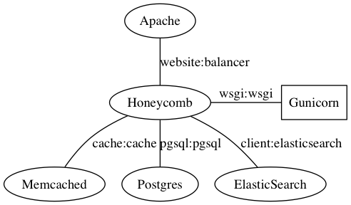

# Deploying Honeycomb

Once the django charm is updated, the canonical (hah) way to deploy Honeycomb will be through juju.  The deployment will look as follows:

Until then, you can get up and running with:

* Get `honeycomb/settings.py` set up to your requirements
* Run `make deps migrate`
* Edit files in flatpage-defaults (look for 'Site owner' and make any changes necessary)
* Run `make update-flatpages collectstatic` \*
* If you aren't running from a virtualenv, you will need to update system libraries with `sudo pip install -r requirements.txt`
* Run `make check-deploy` and fix any issues
* Set up your server to host the wsgi app and the static pages from `static/`
(see [the docs](https://docs.djangoproject.com/en/1.10/howto/deployment/))
* TODO create a superuser

\* If you have created new flatpages, they won't automatically be added to the database.  If you want them added, you must run `venv/bin/python manage.py update-flatpages --create-missing`.  Flatpage urls are generated from the filenames, replacing '-' in the filename with '/' in the URL.  The title will just be the filename, so you should update it.
